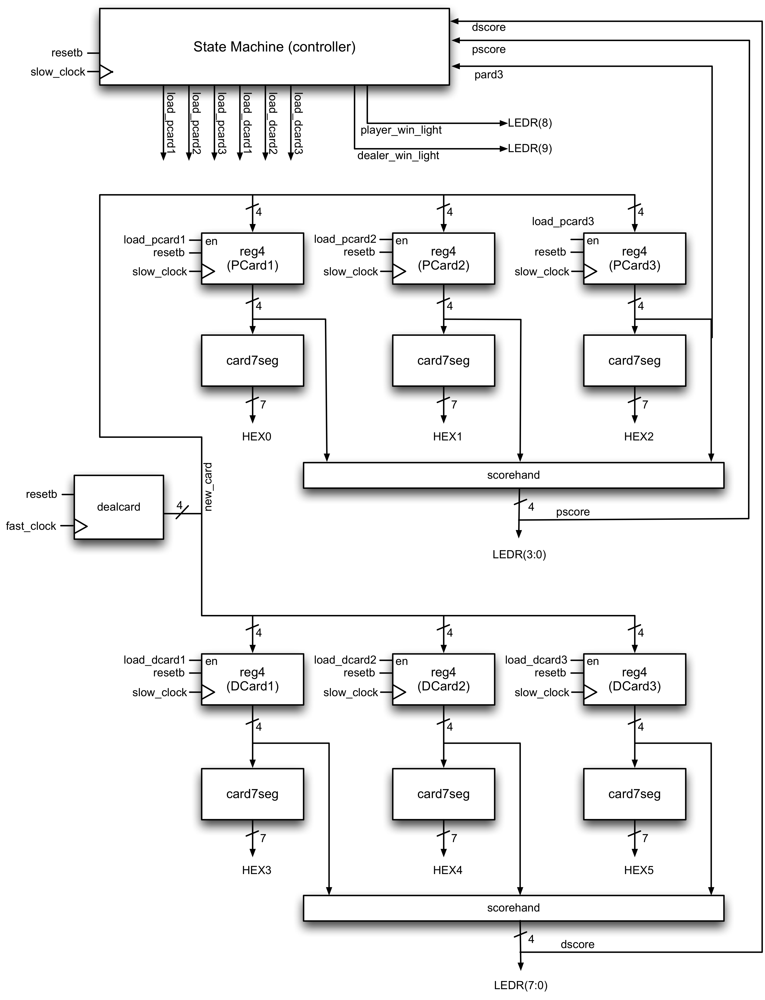
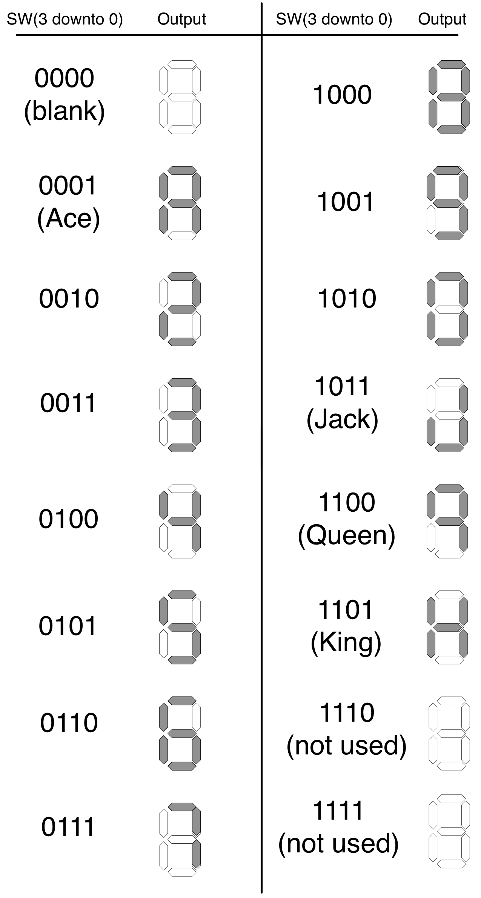

# CPEN-311-LAB-1

## 1 Introduction:
This lab implements a game of baccarat using SystemVerilog HDL. The hardware to run this on is the DE1-SoC. 
The code was written and simulated using ModelSim and synthesized with Intel Quartus Prime. Below is the overall design structure.

## 2 How to Play Baccarat
- Two cards are dealt to both the player and the dealer (i.e., the banker) face up (first card to the player, second card to dealer, third card to the player, fourth card to the dealer).
- The score of each hand is computed using the face values of each card. 
  - Cards A-9 use face values whereas 10, J, Q, and K have 0 value. Suits do not matter, and Jokers are not included  
- If the player’s or banker’s hand has a score of 8 or 9, the game is over (this is called a “natural”) and whoever has the higher score wins (if the scores are the same, it is a tie)
- Otherwise, if the player’s score from his/her first two cards was 0 to 5:
  - the player gets a third card
  - the banker may get a third card depending on the following rule:
    1. If the banker’s score from the first two cards is 7, the banker does not take another card
    1. If the banker’s score from the first two cards is 6, the banker gets a third card if the face value of the player’s third card was a 6 or 7
	1. If the banker’s score from the first two cards is 5, the banker gets a third card if the face value of the player’s third card was 4, 5, 6, or 7
    1. If the banker’s score from the first two cards is 4, the banker gets a third card if the face value of player’s third card was 2, 3, 4, 5, 6, or 7
    1. If the banker’s score from the first two cards is 3, the banker gets a third card if the face value of player’s third card was anything but an 8
	1. If the banker’s score from the first two cards is 0, 1, or 2, the banker gets a third card.
- Otherwise, if the player’s score from his/her first two cards was 6 or 7:
  - the player does _not_ get a third card
  - if the banker’s score from his/her first two cards was 0 to 5:
    - the banker gets a third card
  - otherwise the banker does not get a third card
- The game is over. Scores are computed as below. Whoever has the higher score wins, or if they are the same, it is a tie.

## 3 File Explanation
card7seg.sv drives the BCD (binary-coded decimal display). Each segmented display has 7 LEDs. When given a value of 0, the individual segment lights up. 
For reference, here is the specific BCD used in this lab.

datapath.sv connects key modules together and allows Baccarat to run properly. It instantiates necessary wires and registers as per the design.

dealcard.sv generates pseudo-random cards using an internal 50 MHz clock.

scorehand.sv calculates the score using a combinational circuit. The score follows the rules outlined above.

statemachine.sv includes a finite statemachine with 9 states. It is traversed using the "slow_clock" which is simulated by button presses on the DE1-SoC. The circuit uses the negative edge of the button press. There is a synchronous reset and stage in place. A combinational circuit works with the datapath to enable registers for new cards and displays the result using LEDs.

task4.sv and task5.sv are identical files which are the top level files for Quartus to build the project on. It describes the entire design using each of the files listed above.

## 4 Testbenches

Each file has a testbench that simulates the design using ModelSim. Although not every possible case was simulated (there are far too many), random cases were chosen and tested.
"Assert" statements were used with "$display" to allow for a more convienient viewing process. Of course, the waveform also exists in tandem with these terminal messages.

